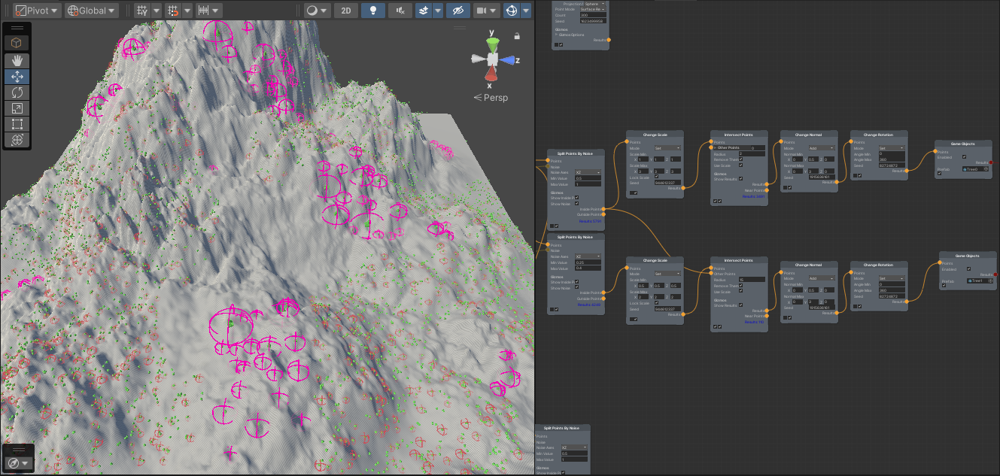
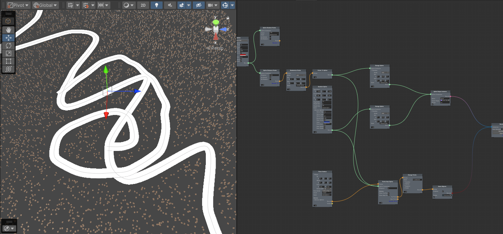
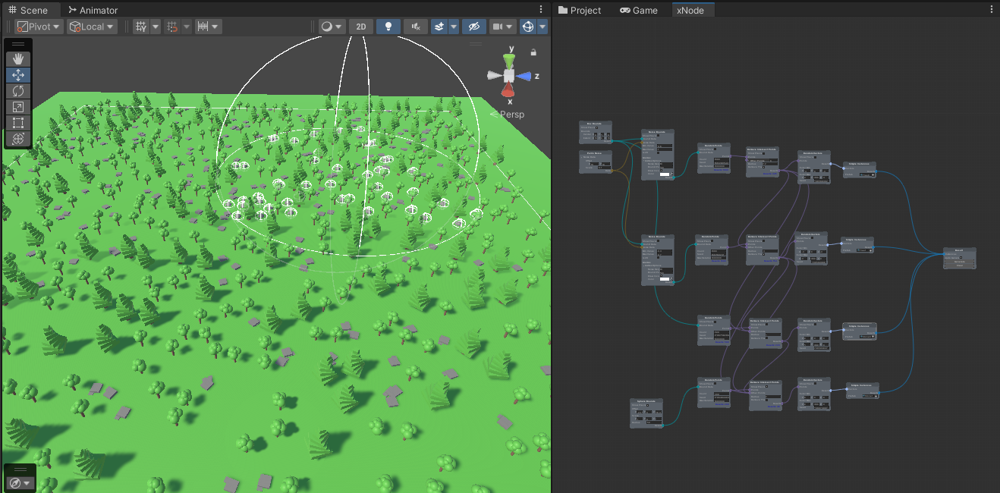
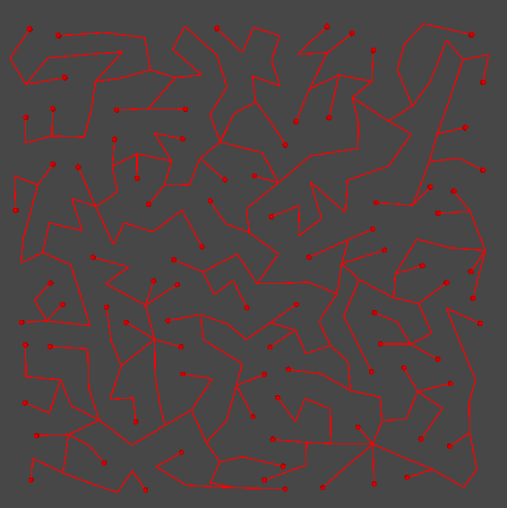
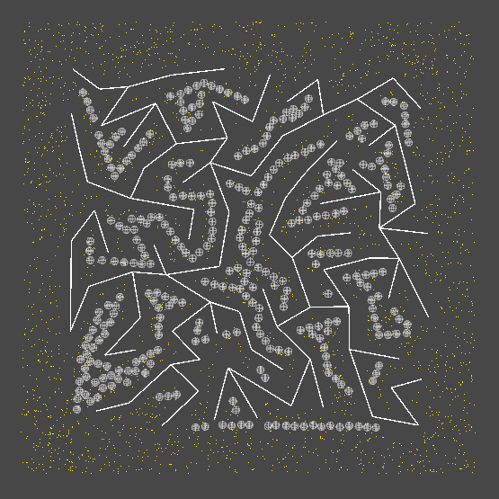
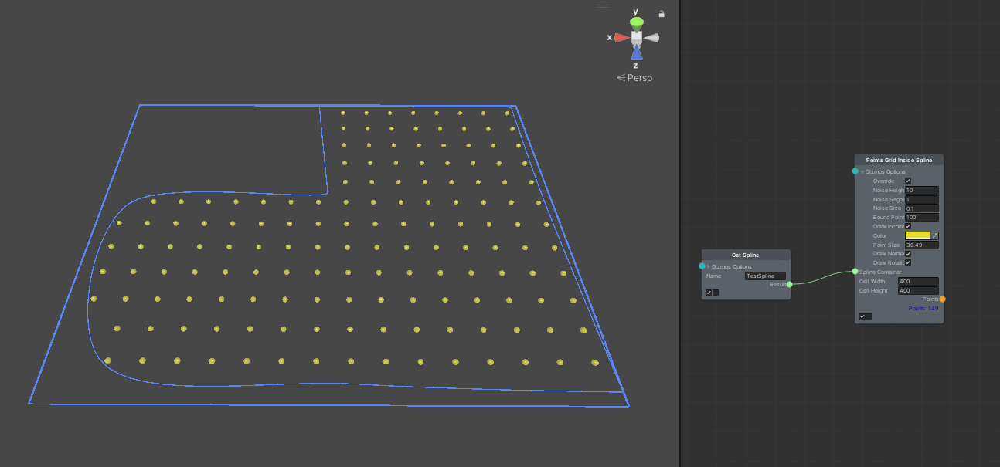
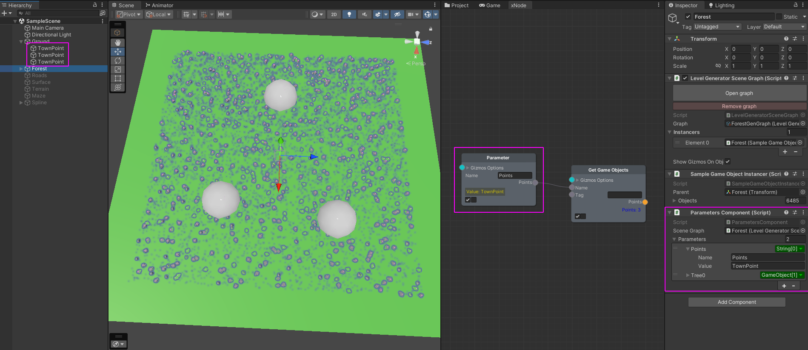

# Level Generator (PCG for Unity)

[](https://opensource.org/license/mit)


Node-based procedural content generator.

## Installation

### Dependencies

Install xNode from https://github.com/siccity/xNode

For **Mazes Addon** install Triangulation Delone from https://github.com/elmortem/triangulation-delone

For **Parameters Addon** install Unity SerializeReference Property Drawer from https://github.com/elmortem/serializereferenceeditor

### Packages

#### Level Generator

Installation as a unity module via a git link in PackageManager:
```
https://github.com/elmortem/levelgenerator.git?path=Packages/levelgenerator
```
Or direct editing of `Packages/manifest' is supported.json:
```
"com.elmortem.levelgenerator": "https://github.com/elmortem/levelgenerator.git?path=Packages/levelgenerator",
```

#### Splines Addon
Support splines for generate points and SpriteShapeInstanceData for make SpriteShapes
```
https://github.com/elmortem/levelgenerator.git?path=Packages/levelgenerator_splines
```
```
"com.elmortem.levelgenerator_splines": "https://github.com/elmortem/levelgenerator.git?path=Packages/levelgenerator_splines",
```

#### Maze Addon
Support maze generator (using Minimum Spanning Tree) for generate maze - Graph, Splines, Points. Implement grid maze and point cloud maze (using triangulation Delone).
```
https://github.com/elmortem/levelgenerator.git?path=Packages/levelgenerator_mazes
```
```
"com.elmortem.levelgenerator_mazes": "https://github.com/elmortem/levelgenerator.git?path=Packages/levelgenerator_mazes",
```

#### Paramaters Addon
Support external parameters for nodes. Not support for all nodes yet, in progress...
```
https://github.com/elmortem/levelgenerator.git?path=Packages/levelgenerator_parameters
```
```
"com.elmortem.levelgenerator_parameters": "https://github.com/elmortem/levelgenerator.git?path=Packages/levelgenerator_parameters",
```

## LevelGeneratorGraph asset

Create asset from Create menu selected Level Generator/Graph 

## Scene

Create GameObject on scene and add component LevelGeneratorSceneGraph and component LevelInstancer. Select your LevelGeneratorGraph.

## Generation

Open graph asset by double click and add nodes by right click. Connect nodes and finish all your work in Result node.

Relax and [read wiki](https://github.com/elmortem/levelgenerator/wiki/) for more info (in progress...).

## Screenshots

       

### Other

Support Unity 2022.3 or later.

Enjoy!
